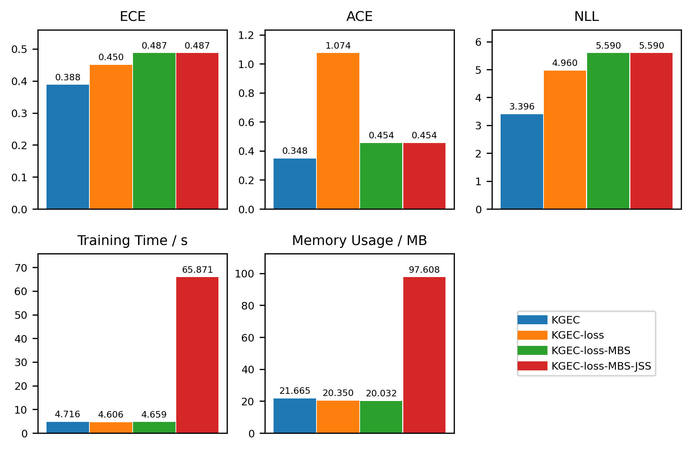
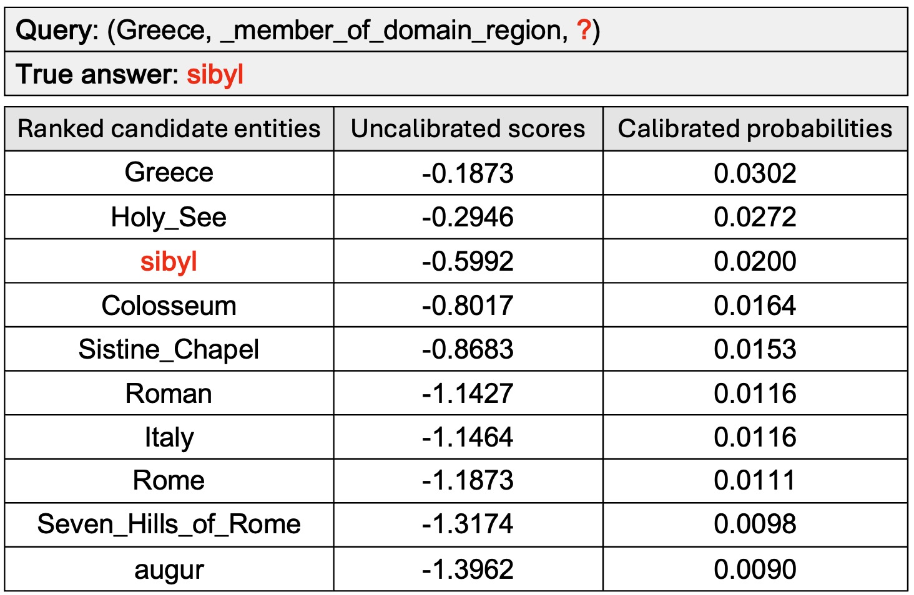
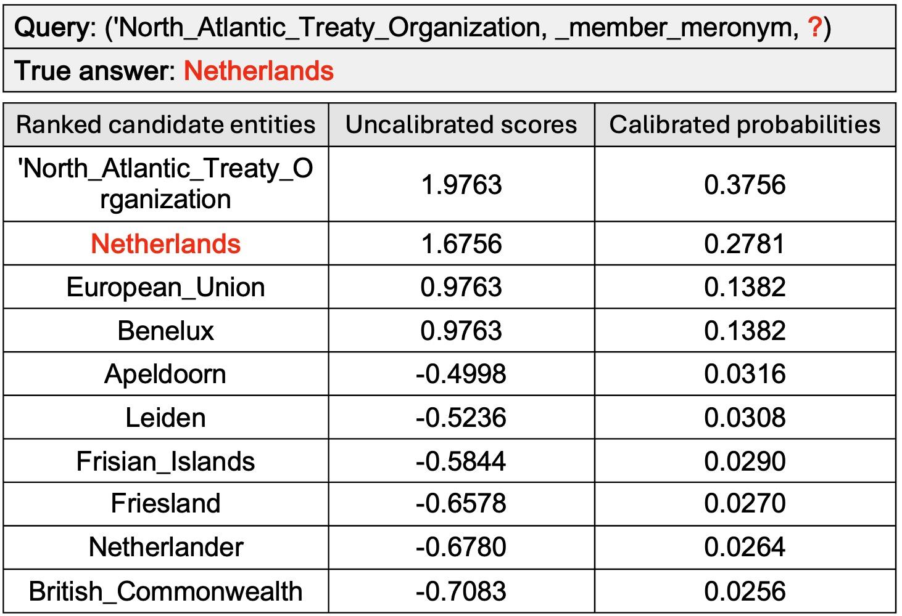

# KGE Calibrator: An Efficient Probability Calibration Method of Knowledge Graph Embedding Models for Trustworthy Link Prediction

This repository provides the official implementation of **KGE Calibrator (KGEC)**, a novel and efficient probability calibration method from our EMNLP 2025 paper. KGEC makes link prediction in Knowledge Graphs more trustworthy by producing well-calibrated probabilities without hurting ranking performance. 

---
### The Problem: KGE Models are Confident but Wrong

Knowledge Graph Embedding (KGE) models are great at predicting links, but they are often **poorly calibrated**. This means their confidence scores don't match the true likelihood of a prediction being correct, making them unreliable for real-world applications where trust is crucial. Existing calibration methods fail on KGs due to the massive number of potential answers (entities) and the focus on ranking over true probability.

### Our Solution: KGE Calibrator (KGEC)

**KGEC** is a post-processing method designed specifically to solve this. It's both **effective** and **highly efficient**.

**Key Features**

- ⚡️ **Efficient Training**: A **jump selection strategy** smartly focuses on the most informative training samples, making KGEC scalable to massive knowledge graphs where other methods fail.

- ✨ **Expressive Modeling**: A **multi-binning scaling** mechanism learns different "temperature" values for different confidence levels, accurately correcting both high and low model confidence scores.

- 💧 **Robust Optimization**: A **Wasserstein distance-based loss** function enables smooth, distribution-aware optimization, achieving superior calibration. This is the first time this loss has been used for probability calibration.

### 🧠 Contributions

- ✅ We evaluate nine widely used post-processing calibration methods and identify four that are unsuitable for entity prediction due to their poor performance and adverse impact on ranking-based metrics.
- ✅ We propose **KGEC**, the first probability calibration method specifically designed for KGE models, which addresses the challenge of large-scale class space while preserving original link prediction rankings.
- ✅ We conduct a thorough experimental study on four benchmark datasets, demonstrating that KGEC **consistently outperforms** existing calibration methods in terms of both **effectiveness and efficiency**.

---

## 🔍 Overview

You can evaluate KGEC with the following KGE models:

* **TransE** (`Main-Transe.py`)
* **ComplEx** (`Main-ComplEx.py`)
* **DistMult** (`Main-DistMult.py`)
* **RotatE** (`Main-RotatE.py`)

After training the KGE model, KGEC is applied as a post-hoc calibrator to improve the trustworthiness and reliability of the link prediction results by producing better-calibrated probability estimates. 

---

## 🗂 Project Structure

```bash
.
├── Main-Transe.py          # Main script for TransE
├── Main-ComplEx.py         # Main script for ComplEx
├── Main-DistMult.py        # Main script for DistMult
├── Main-RotatE.py          # Main script for RotatE
├── KGEC_method.py          # Core implementation of KGE Calibrator
├── calibration_training.py # KGE model training and evaluation logic
├── dataloader.py           # Dataset handling and loaders
├── calutils.py             # Helper functions for calibration
├── requirements.txt        # Python dependencies
├── Figures/                # Contains plots (e.g., Ablation_Study_plot.png, case1.jpg, case2.jpg)
```

---

## ⚙️ Installation

Make sure Python 3.10.12 is installed. Then run:

```bash
pip install -r requirements.txt
```

---

## 🏃‍♂️ Running the Code

To train a KGE model, such as TransE, and calibrate it with KGEC:

```bash
python Main-Transe.py
```

To try other KGE models:

```bash
python Main-ComplEx.py
python Main-DistMult.py
python Main-RotatE.py
```

You can adjust training or calibration parameters:

```bash
python Main-Transe.py --KGEC_learning_rate 0.01 --KGEC_num_bins 10
```

---

## 🔧 Key Arguments

| Argument                     | Description                                                |
| ---------------------------- | ---------------------------------------------------------- |
| `--data_path`                | Path to the dataset (e.g., `../data/wn18`)                 |
| `--model`                    | KGE model type (`TransE`, `ComplEx`, `DistMult`, `RotatE`) |
| `--KGEC_num_bins`            | Number of bins of KGEC (default: 10)            |
| `--KGEC_learning_rate`       | Learning rate of KGEC (default: 0.01)                     |
| `--KGEC_initial_temperature` | Initial bin temperature of KGEC (default: 1.0)                     |

---

## 🔧 Configuration Details

Most of the arguments in scripts like `Main-TransE.py` are used to configure and train the underlying **Knowledge Graph Embedding (KGE) model**, such as TransE, ComplEx, DistMult, or RotatE.

To apply KGEC, we must first **train the KGE model to obtain entity and relation embeddings**, which are then used as input for the calibration step.

### 🔹 KGEC-Specific Hyperparameters

Only the following arguments configure the KGEC calibration process:

- `--KGEC_num_bins`  
  *Number of bins used in the multi-binning scaling module.*  

- `--KGEC_learning_rate`  
  *Learning rate for optimizing KGEC parameters.*  

- `--KGEC_initial_temperature`  
  *Initial temperature value for multi-bin specific temperature scaling.*  

These should be tuned only if you wish to adjust the behavior of the calibration process itself. The rest of the arguments are inherited from the base KGE training configuration.

---
## 📊 Experiment Results

See the full set of calibration performance, efficiency, ablation study, and case study in the following sections:

- `📉 Expected Calibration Error (ECE)`  
- `📉 Adaptive Calibration Error (ACE)`  
- `📉 Negative Log-Likelihood (NLL)`  
- `⏱️ Training Time (seconds)`  
- `💾 Memory Usage (MB)`  
- `📊 Ablation Study`  
- `🔍 Case Study`  

### 📉 Expected Calibration Error (ECE)
Lower values indicate better calibration performance.

| Dataset / Model      | Uncalibrated | Platt Calibrator | Vector Scaling | Temperature Scaling | PTS  | **KGEC** |
|----------------------|--------------|------------------|--------|----------------------|------|----------|
| TransE (WN18)        | 0.502        | 0.634            | 0.706  | 0.634                | 0.523| 0.171 |
| TransE (WN18RR)      | 0.265        | 0.031            | 0.014  | 0.031                | 0.013| 0.280 |
| TransE (FB15K)       | 0.580        | 0.530            | 0.646  | 0.680                | 0.530| 0.459 |
| TransE (FB15K-237)   | 0.212        | 0.218            | 0.231  | 0.203                | 0.231| 0.150 |
| ComplEx (WN18)       | 0.852        | 0.854            | 0.852  | 0.852                | 0.854| 0.833 |
| ComplEx (WN18RR)     | 0.424        | 0.427            | 0.424  | 0.424                | 0.430| 0.418 |
| ComplEx (FB15K)      | 0.696        | 0.701            | 0.697  | 0.701                | 0.060| 0.678 |
| ComplEx (FB15K-237)  | 0.228        | 0.229            | 0.228  | 0.228                | 0.214| 0.189 |
| DistMult (WN18)      | 0.528        | 0.529            | 0.528  | 0.528                | 0.456| 0.446 |
| DistMult (WN18RR)    | 0.389        | 0.394            | 0.389  | 0.389                | 0.393| 0.383 |
| DistMult (FB15K)     | 0.694        | 0.700            | 0.695  | 0.700                | 0.526| 0.683 |
| DistMult (FB15K-237) | 0.221        | 0.222            | 0.215  | 0.221                | 0.778| 0.178 |
| RotatE (WN18)        | 0.429        | 0.876            | 0.944  | 0.687                | 0.337| 0.467 |
| RotatE (WN18RR)      | 0.385        | 0.425            | 0.413  | 0.384                | 0.425| 0.307 |
| RotatE (FB15K)       | 0.684        | 0.722            | 0.739  | 0.722                | 0.221| 0.466 |
| RotatE (FB15K-237)   | 0.224        | 0.235            | 0.239  | 0.223                | 0.365| 0.094 |
| **Average**          | 0.457        | 0.483            | 0.498  | 0.475                | 0.397| **0.388** |

---

### 📉 Adaptive Calibration Error (ACE)
Lower values indicate better calibration performance.

| Dataset / Model      | Uncalibrated | Platt Calibrator | Vector Scaling | Temperature Scaling | PTS  | **KGEC** |
|----------------------|--------------|------------------|--------|----------------------|------|----------|
| TransE (WN18)        | 0.506        | 0.628            | 0.506  | 0.628                | 0.516| 0.131 |
| TransE (WN18RR)      | 0.274        | 0.033            | 0.274  | 0.033                | 0.013| 0.277 |
| TransE (FB15K)       | 0.565        | 0.530            | 0.565  | 3.312                | 0.530| 0.293 |
| TransE (FB15K-237)   | 0.180        | 0.217            | 0.180  | 0.154                | 0.231| 0.082 |
| ComplEx (WN18)       | 0.852        | 0.854            | 0.852  | 0.852                | 0.854| 0.833 |
| ComplEx (WN18RR)     | 0.424        | 0.427            | 0.424  | 0.423                | 0.424| 0.418 |
| ComplEx (FB15K)      | 0.696        | 0.701            | 0.697  | 0.701                | 0.060| 0.465 |
| ComplEx (FB15K-237)  | 0.228        | 0.229            | 0.228  | 0.228                | 0.207| 0.207 |
| DistMult (WN18)      | 0.528        | 0.529            | 0.528  | 0.528                | 0.446| 0.457 |
| DistMult (WN18RR)    | 0.389        | 0.394            | 0.389  | 0.389                | 0.391| 0.383 |
| DistMult (FB15K)     | 0.694        | 0.700            | 0.694  | 0.700                | 0.522| 0.516 |
| DistMult (FB15K-237) | 0.220        | 0.222            | 0.215  | 0.220                | 0.778| 0.199 |
| RotatE (WN18)        | 0.429        | 0.876            | 0.429  | 0.687                | 0.337| 0.467 |
| RotatE (WN18RR)      | 0.385        | 0.425            | 0.385  | 0.384                | 0.418| 0.306 |
| RotatE (FB15K)       | 0.684        | 0.722            | 0.684  | 0.722                | 0.221| 0.466 |
| RotatE (FB15K-237)   | 0.224        | 0.235            | 0.224  | 0.222                | 0.363| 0.063 |
| **Average**          | 0.455        | 0.483            | 0.455  | 0.636                | 0.394| **0.348** |

---

### 📉 Negative Log-Likelihood (NLL)
Lower values indicate better calibration performance.

| Dataset / Model      | Uncalibrated | Platt Calibrator | Vector Scaling | Temperature Scaling | PTS  | **KGEC** |
|----------------------|--------------|------------------|--------|----------------------|------|----------|
| TransE (WN18)        | 2.891        | 3.839            | /      | 3.839                | /    | 2.462 |
| TransE (WN18RR)      | 6.582        | 7.304            | /      | 7.304                | 9.181| 5.965 |
| TransE (FB15K)       | 3.911        | 3.829            | /      | 1.285                | 3.829| 2.536 |
| TransE (FB15K-237)   | 5.396        | 5.836            | /      | 4.909                | 9.448| 2.889 |
| ComplEx (WN18)       | 6.892        | 8.831            | 6.892  | 6.892                | 9.314| 4.350 |
| ComplEx (WN18RR)     | 7.815        | 8.974            | 7.814  | 7.802                | 9.171| 6.965 |
| ComplEx (FB15K)      | 5.954        | 7.093            | 5.952  | 7.093                | 1.906| 1.357 |
| ComplEx (FB15K-237)  | 7.513        | 8.438            | 7.510  | 7.513                | 5.714| 2.911 |
| DistMult (WN18)      | 7.447        | 9.117            | 7.446  | 7.447                | /    | 2.843 |
| DistMult (WN18RR)    | 7.858        | 9.065            | 7.857  | 7.856                | 9.496| 7.119 |
| DistMult (FB15K)     | 5.919        | 7.257            | 5.916  | 7.257                | 4.847| 1.319 |
| DistMult (FB15K-237) | 7.705        | 8.621            | 7.692  | 7.704                | /    | 3.106 |
| RotatE (WN18)        | 1.376        | 3.350            | 1.376  | 2.069                | /    | 1.036 |
| RotatE (WN18RR)      | 6.145        | 7.364            | /      | 6.121                | /    | 4.698 |
| RotatE (FB15K)       | 4.090        | 4.799            | /      | 4.799                | /    | 2.033 |
| RotatE (FB15K-237)   | 5.750        | 6.271            | nan    | 5.617                | /    | 2.743 |
| **Average**          | 5.828        | 6.874            | 6.495  | 5.969                | 6.990| **3.396** |

---

### ⏱️ Training Time (Seconds) 
Lower values indicate higher efficiency. 

| Dataset / Model      | Platt Calibrator | Vector Scaling | Temperature Scaling | PTS     | **KGEC** |
|----------------------|------------------|--------|----------------------|---------|----------|
| TransE (WN18)        | 50551.471        | 2.857  | 5.235                | 3452.440| 2.727 |
| TransE (WN18RR)      | 32130.612        | 1.893  | 3.207                | 2123.849| 1.776 |
| TransE (FB15K)       | 66566.552        | 25.357 | 20.037               |16769.166| 10.873 |
| TransE (FB15K-237)   | 22756.968        | 3.493  | 6.475                | 5856.000| 3.602 |
| ComplEx (WN18)       | 44484.280        | 2.661  | 5.063                | 3432.436| 2.698 |
| ComplEx (WN18RR)     | 27740.023        | 1.620  | 3.121                | 2122.273| 1.727 |
| ComplEx (FB15K)      | 66631.859        | 16.228 | 18.825               |16510.019| 10.560 |
| ComplEx (FB15K-237)  | 20060.975        | 3.218  | 6.276                | 5764.345| 3.624 |
| DistMult (WN18)      | 48902.412        | 4.114  | 5.180                | 3450.331| 2.741 |
| DistMult (WN18RR)    | 31739.057        | 1.914  | 3.204                | 2120.555| 1.696 |
| DistMult (FB15K)     | 58074.230        | 20.779 | 19.734               |16898.528| 10.645 |
| DistMult (FB15K-237) | 21682.032        | 3.456  | 6.412                | 5868.468| 3.705 |
| RotatE (WN18)        | 46162.422        | 2.656  | 5.456                | 3425.148| 2.662 |
| RotatE (WN18RR)      | 30198.810        | 1.706  | 3.171                | 2113.001| 1.658 |
| RotatE (FB15K)       | 65506.688        | 25.995 | 20.646               |16802.984| 10.758 |
| RotatE (FB15K-237)   | 20522.725        | 3.277  | 6.345                | 5853.287| 4.003 |
| **Average**          | 40856.945        | 7.577  | 8.649                | 7035.177| **4.716** |

---

### 💾 Memory Usage (MB) 
Lower values indicate higher efficiency. 

| Dataset / Model      | Platt Calibrator | Vector Scaling | Temperature Scaling | PTS       | **KGEC** |
|----------------------|------------------|--------|----------------------|-----------|----------|
| TransE (WN18)        | 1564.336         | 84.477 | 1562.625             | 6655.574  | 30.484 |
| TransE (WN18RR)      | 950.762          | 84.383 | 948.453              | 7017.359  | 28.289 |
| TransE (FB15K)       | 5706.102         | 86.098 | 5703.750             |11154.340  | 7.570  |
| TransE (FB15K-237)   | 1948.508         | 84.348 | 1947.629             | 9554.723  | 15.273 |
| ComplEx (WN18)       | 1566.598         | 82.059 | 1562.984             | 6804.816  | 26.652 |
| ComplEx (WN18RR)     | 950.270          | 83.152 | 949.285              | 7022.313  | 32.176 |
| ComplEx (FB15K)      | 5706.832         | 86.918 | 5703.047             |10185.500  | 9.535  |
| ComplEx (FB15K-237)  | 1948.664         | 80.770 | 1945.566             | 9629.871  | 15.285 |
| DistMult (WN18)      | 1565.820         | 83.609 | 1562.340             | 6957.012  | 34.316 |
| DistMult (WN18RR)    | 949.633          | 83.883 | 948.504              | 6696.055  | 32.047 |
| DistMult (FB15K)     | 5705.828         | 80.883 | 5704.801             |10180.105  | 10.531 |
| DistMult (FB15K-237) | 1947.574         | 81.320 | 1945.828             | 9407.988  | 13.492 |
| RotatE (WN18)        | 1566.477         | 80.570 | 1562.914             | 7047.270  | 34.320 |
| RotatE (WN18RR)      | 950.793          | 83.145 | 948.566              | 7074.051  | 32.191 |
| RotatE (FB15K)       | 5706.875         | 86.152 | 5703.359             |10521.520  | 7.551  |
| RotatE (FB15K-237)   | 1948.371         | 80.941 | 1944.730             | 8659.395  | 16.930 |
| **Average**          | 2542.715         | 83.294 | 2540.274             | 8410.493  | **21.665** |

---

### 📊 Ablation study (Lower = Better)
Lower values indicate better calibration performance and higher efficiency.

<table>
<tr><td></td></tr>
<tr><td align="center"><em>Figure: Ablation study of KGEC components across five evaluation metrics: ECE, ACE, NLL, training time (seconds), and memory usage (MB). In this figure, loss is the Wasserstein Loss, MBS means Multi-Binning Scaling, and JSS refers to Jump Selection Strategy.</em></td></tr>
</table>

---

### 🔍 Case study

<table>
<tr><td></td></tr>
<tr><td align="center"><em>Figure: Case 1 from the WN18RR dataset using the TransE model.</em></td></tr>
</table>

<table>
<tr><td></td></tr>
<tr><td align="center"><em>Figure: Case 2 from the WN18RR dataset using the TransE model.</em></td></tr>
</table>

Note: All evaluations are conducted using CPU only for fair comparison.

---

## 📂 Outputs

* `train.log` and `test.log` contain detailed training and evaluation verbose logs
* Learned embeddings saved as `.npy` files (such as `entity_embedding.npy`, `relation_embedding.npy`)
* Both ranking performance and calibration performance — before and after applying KGEC — are clearly logged

---

## Happy Calibrating! 🚀

---